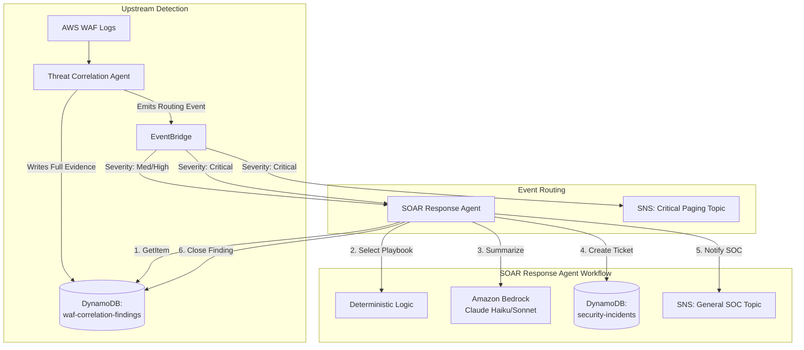

# Enterprise SOAR Incident Response Pipeline
### Architectural Breakdown

---

## 1. Overview

This system is not a single Lambda function — it is a multi-stage assembly line for handling security events, moving from raw detection through to human notification. Understanding the flow end-to-end before writing any Terraform or Python is the difference between "scripting" and "systems design."

The pipeline has four conceptual stations:

1. **The Sensor** (Upstream) — AWS WAF blocks or logs a suspicious request.
2. **The Detective** (Upstream) — A Threat Correlation Agent analyzes the logs, confirms it's a real threat, and writes a detailed "Finding" to DynamoDB.
3. **The Doorbell** (EventBridge) — The Correlation Agent emits a lightweight event: *"a new finding was created."*
4. **The Responder** (This Build) — The SOAR Response Agent wakes up, investigates, writes the ticket, and alerts the humans.

---

## 2. Architecture Diagram

**Key mental model:** EventBridge events are *notifications*, not *payloads*. The event only carries the finding ID and severity — never the full evidence. The Lambda then goes and fetches the actual evidence from DynamoDB. This is sometimes called a **"fat resource, thin event"** pattern: it keeps events small (avoiding EventBridge's 256KB payload limit) and ensures there is a single source of truth for the data, rather than evidence scattered across event payloads.

---

## 3. Core Components

### A. The Data Layer (DynamoDB)

Two tables represent two distinct stages in the lifecycle of a threat:

| Table | Owner | Purpose |
|---|---|---|
| **`waf-correlation-findings`** (Evidence Locker) | Created by the upstream Correlation Agent; read and updated by the SOAR Agent | Holds raw evidence — IPs, WAF rules triggered, correlation reports |
| **`security-incidents`** (Ticketing System) | Created by the SOAR Agent | The official ticket for human SOC analysts — contains the playbook decision, AI-generated summary, and status (`OPEN`, `ESCALATED`, `CLOSED`) |

**Why two tables instead of one?** A finding and an incident have different lifecycles and different audiences. A finding is a piece of evidence — largely immutable, technical, written once. An incident is a workflow object for analysts, with status transitions over time. Separating them allows each to be queried and evolved independently — for example, analysts search `security-incidents` by status, while `waf-correlation-findings` functions purely as an audit trail.

### B. The Routing Layer (EventBridge)

Two EventBridge rules listen for the same `WAF Threat Finding Created` event, but route it differently based on the `detail.severity` field:

- **Rule 1 (Standard):** Matches `MEDIUM` and `HIGH` → routes only to the SOAR Lambda.
- **Rule 2 (Panic Button):** Matches `CRITICAL` → routes to the SOAR Lambda **and** directly to an SNS topic, in parallel.

**Why the parallel path for Critical?** If data is actively being exfiltrated, the human notification should not be *dependent on* the Lambda successfully completing its full sequence — DynamoDB read, Bedrock call, ticket write, SNS publish — any of which could fail or add latency. The critical alert fires immediately and independently at the routing layer, while the Lambda still does its normal investigative work in parallel.

**General principle:** don't gate your most urgent alert behind your most complex code path.

### C. The Compute Layer (SOAR Lambda)

The Lambda operates as a strict, linear 6-step sequence:

1. **Extract & Fetch** — Pulls the `finding_id` from the event and fetches the full record from DynamoDB.
2. **Validate** — Confirms the finding isn't already closed or processed, preventing duplicate work.
3. **Select Playbook** — Uses a hardcoded mapping of Severity → Action (e.g., `HIGH` = Escalate). **The AI does not make this decision.**
4. **Enrich** — Sends the evidence to Amazon Bedrock with a constrained prompt to generate an executive summary and analyst checklist. If Bedrock fails, falls back to a hardcoded text template.
5. **Record & Notify** — Creates the incident ticket in `security-incidents` (using idempotent conditional writes) and publishes the summary to SNS.
6. **Close the Loop** — Updates the original `waf-correlation-findings` record to `RESPONSE_COMPLETED`.

**Important distinction:** Bedrock's only role is to produce a human-readable summary of a decision that has *already been made deterministically* in step 3. Non-deterministic components (LLMs) sit only in the explanation/formatting layer — never in the decision or control path for security automation.

---

## 4. Three Senior-Level Architectural Patterns

### Pattern 1 — Idempotency via Deterministic IDs

EventBridge guarantees **at-least-once** delivery, meaning retries and duplicate invocations will happen.

- **Mechanism:** The Incident ID is generated deterministically: `INC-<finding_id>`.
- **Result:** When a retry attempts to write to DynamoDB, `ConditionExpression="attribute_not_exists(incident_id)"` catches the duplicate. The code recognizes "ticket already exists" and skips creation — no duplicate tickets or SNS spam.

*This exact pattern — conditional writes for idempotency in response automation — is directly relevant to AWS Security Specialty exam scenarios on resilient incident response design.*

### Pattern 2 — Defensive Prompting (AI Guardrails)

In enterprise SOAR, AI hallucinations can cause real operational harm (e.g., an AI recommending an automatic block on a legitimate internal IP).

- **Mechanism:** The Bedrock prompt explicitly forbids destructive recommendations — e.g., instructing the model not to recommend automatic IP blocking and to state clearly that human review is required.
- **Result:** The AI acts strictly as a *paraphraser and formatter* of deterministic evidence, never as an autonomous decision-maker.

**Caveat worth internalizing:** prompt instructions reduce the *likelihood* of unwanted output — they do not *guarantee* it. The real safety mechanism is architectural (step 3 keeps all decision authority out of the AI's hands), not the wording of the prompt. Prompting is a nudge; architecture is the guarantee.

### Pattern 3 — The "Golden Rule" Fallback

Cloud services fail. Bedrock may throttle the account or be temporarily unavailable in-region.

- **Mechanism:** The Bedrock call is wrapped in a `try/except` block. On failure, it immediately calls `create_fallback_summary()`, generating a standard hardcoded alert.
- **Result:** The security workflow **never stops**. The incident is still created and the SOC is still notified, even if the AI layer is completely offline.

This is a graceful degradation pattern: security automation should degrade to "less polished but still functional," rather than fail silently or fail closed.

---

## 5. IAM Consideration (Least Privilege)

The Lambda's execution role should be scoped precisely, not broadly:

- `dynamodb:GetItem` / `PutItem` / `UpdateItem` — scoped to the **specific ARNs** of the two tables only (not `dynamodb:*` on `*`)
- `sns:Publish` — scoped to the specific topic ARNs used
- `bedrock:InvokeModel` — scoped to the specific model ARN in use

This is a direct, practical exercise in the least-privilege principle central to both real-world security engineering and the AWS Security Specialty exam.

---

## 6. Build Order

When ready to implement, the recommended sequence is:

1. **Data Stores** — Terraform for the two DynamoDB tables (`waf-correlation-findings`, `security-incidents`)
2. **Notification Layer** — Terraform for the SNS topics and EventBridge rules
3. **Compute & IAM** — Terraform for the SOAR Lambda, with an IAM role scoped precisely to `GetItem`/`PutItem` on both tables, `sns:Publish`, and `bedrock:InvokeModel`
4. **Logic** — Deploy the Python handler and test idempotency by firing the same EventBridge event twice