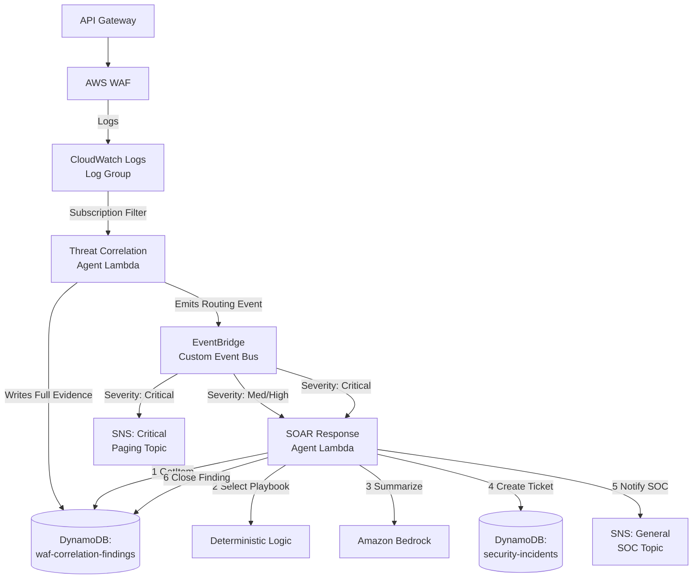

# SOAR Incident Response Pipeline — Build Guide (CloudWatch Logs Variant)

**Starting point (already built):** AWS WAF attached to API Gateway, logging to a **CloudWatch Logs log group**.

This changes Step 1 of the pipeline meaningfully. S3-based ingestion (the previous version of this guide) is *pull-based via event notification* — an object lands, S3 fires an event, Lambda picks it up whenever it's ready. CloudWatch Logs ingestion is different in a way that affects your architecture choice, not just a config swap.

---

## 1. What Changes, and Why It's Not a Trivial Swap

CloudWatch Logs has exactly one native "push" mechanism for real-time processing: a **subscription filter**. A subscription filter on the WAF log group can push matching log events to one of three destinations:

- **Lambda** (direct invoke)
- **Kinesis Data Streams**
- **Kinesis Data Firehose**

**The key architectural decision:** subscription filter → Lambda directly, or subscription filter → Firehose → S3 → Lambda?

| Approach | Latency | Cost at scale | Complexity | Batching control |
|---|---|---|---|---|
| Subscription filter → Lambda (direct) | Lowest | Higher per-invocation cost at high volume (many small invocations) | Simplest | Lambda receives small batches, no control over grouping |
| Subscription filter → Firehose → S3 → Lambda | Higher (Firehose buffers 60s–900s by default) | Cheaper at high volume | More moving parts | You control batch size/time via Firehose buffering config |

**Recommendation for this build: subscription filter → Lambda directly.**

Reasoning: this pipeline exists to catch and respond to threats *quickly* — that's the entire premise of the Critical/SNS panic-button path in your architecture. Introducing a Firehose buffering delay (default 60 seconds minimum) on the ingestion side directly undermines the low-latency goal of the downstream Critical routing rule you already designed. Save Firehose-style batching for a *separate*, non-latency-sensitive pipeline (e.g., long-term log archival to S3 for compliance/audit retention) — don't make your real-time detection path wait on a batching buffer it doesn't need.

This also simplifies your build: **one less service (no Firehose, no separate S3 bucket) sits between WAF and your Correlation Agent.**

---

## 2. Updated Architecture



Everything **downstream of the Correlation Agent is unchanged** from the S3 variant — the two DynamoDB tables, the two EventBridge rules, the SOAR Lambda's 6-step logic, and the Bedrock enrichment all work identically regardless of how WAF logs entered the pipeline. Only the ingestion mechanism (Step 1) and the Correlation Agent's trigger + parsing logic (Step 2) change.

---

## 3. Build Order

### Step 1 — CloudWatch Logs Subscription Filter

**What:** A subscription filter on the WAF log group that pushes matching log events directly to the Correlation Agent Lambda.

```hcl
resource "aws_cloudwatch_log_subscription_filter" "waf_to_lambda" {
  name            = "waf-logs-to-correlation-agent"
  log_group_name  = "aws-waf-logs-<your-web-acl-name>"   # must match WAF's configured log group
  filter_pattern  = ""   # empty = match all log events; narrow this later if volume is high
  destination_arn = aws_lambda_function.correlation_agent.arn
}

resource "aws_lambda_permission" "allow_cwl_invoke" {
  statement_id  = "AllowCloudWatchLogsInvoke"
  action        = "lambda:InvokeFunction"
  function_name = aws_lambda_function.correlation_agent.function_name
  principal     = "logs.amazonaws.com"
  source_arn    = "${aws_cloudwatch_log_group.waf_logs.arn}:*"
}
```

**Why `filter_pattern = ""` to start:** An empty pattern matches every log event, which is the safest default while you're validating the pipeline end-to-end. Once you understand your real traffic volume, narrow this — for example, filtering out `action: ALLOW` events at the subscription level (rather than in Lambda) reduces invocation count and cost, since most WAF log volume in a healthy system is allowed traffic, not blocks.

**Why the explicit `aws_lambda_permission`:** CloudWatch Logs needs resource-based permission to invoke the Lambda — this is easy to forget and is the most common cause of "subscription filter exists but Lambda never fires" during first-time setup.

**A CloudWatch Logs-specific constraint to know now:** a single log group can have **only 2 subscription filters** (as of standard service limits). If you later want a second consumer of these same WAF logs (e.g., a separate archival pipeline to S3, or a SIEM integration), plan for that now — you have exactly one filter slot left after this one.

---

### Step 2 — Threat Correlation Agent (Lambda) + `waf-correlation-findings` Table

**Build this first** (before EventBridge/SOAR) — same reasoning as before: it's the event producer, and nothing downstream is testable without it.

#### 2a. DynamoDB Table — Unchanged

```hcl
resource "aws_dynamodb_table" "waf_correlation_findings" {
  name         = "waf-correlation-findings"
  billing_mode = "PAY_PER_REQUEST"
  hash_key     = "finding_id"

  attribute {
    name = "finding_id"
    type = "S"
  }

  point_in_time_recovery {
    enabled = true
  }

  server_side_encryption {
    enabled = true
  }
}
```

Reasoning is identical to the S3 variant: spiky, unpredictable event volume favors on-demand billing, and point lookups by `finding_id` don't need a sort key.

#### 2b. What Changes in the Lambda Handler Itself

This is the part that actually differs from the S3 version — **the event shape delivered to Lambda is completely different.**

With a CloudWatch Logs subscription filter, Lambda receives a payload that is:
- **Base64-encoded**
- **Gzip-compressed**
- Containing a `logEvents` array, where each entry is one WAF log line (already JSON, but nested as a string inside the CWL wrapper)

```python
import base64
import gzip
import json

def lambda_handler(event, context):
    # CloudWatch Logs subscription payloads arrive compressed and encoded
    compressed_payload = base64.b64decode(event["awslogs"]["data"])
    uncompressed_payload = gzip.decompress(compressed_payload)
    log_data = json.loads(uncompressed_payload)

    findings = []
    for log_event in log_data["logEvents"]:
        waf_record = json.loads(log_event["message"])
        finding = correlate(waf_record)
        if finding:
            findings.append(finding)

    for finding in findings:
        write_finding(finding)
        emit_eventbridge_event(finding)
```

**Why this decode step matters and is easy to get wrong:** unlike the S3 flow (where the Lambda just reads a plain-text or newline-delimited JSON object), the CloudWatch Logs subscription format is a fixed AWS wrapper structure that's always base64 + gzip, regardless of what's inside. Skipping the decode step is the single most common first-run bug with CWL subscription Lambdas — the function receives what looks like garbage binary data and errors immediately.

**Correlation logic itself is unchanged** from the S3 version: same frequency-based escalation (repeated hits from one IP), same rule-based severity assignment (an SQLi/XSS managed-rule match is `HIGH` regardless of frequency), same `finding_id` generation and thin-event emission to EventBridge.

**IAM for this Lambda — one addition vs. the S3 version:** you no longer need `s3:GetObject` (there's no S3 object to read), but you do need the CloudWatch Logs invoke permission set up in Step 1. Otherwise, `dynamodb:PutItem` on `waf-correlation-findings` and `events:PutEvents` on your custom bus remain the same.

---

### Step 3 — EventBridge Routing Layer — **Unchanged**

Same custom event bus, same two severity-scoped rules (Medium/High → Lambda only; Critical → Lambda + SNS in parallel), same reasoning: EventBridge rules can't branch internally, and the critical path must not depend on the SOAR Lambda completing before a human is paged. Refer to the previous build guide's Step 3 in full — nothing here changes based on ingestion method.

---

### Step 4 — SOAR Response Agent (Lambda) + `security-incidents` Table — **Unchanged**

Same table design (including the `status` GSI for analyst queries), same 6-step Lambda logic, same idempotent conditional write pattern (`INC-<finding_id>`, `attribute_not_exists`), same reasoning about at-least-once EventBridge delivery requiring a duplicate-safe write. This component has no dependency on how WAF logs originally entered the system — by the time an event reaches EventBridge, ingestion method is irrelevant.

---

### Step 5 — Bedrock Integration — **Unchanged**

Same constrained prompt (no destructive recommendations, human review required), same `try/except` wrapping with `create_fallback_summary()` on failure, same reasoning: Bedrock is enrichment only, never in the decision path, and the workflow must survive Bedrock being unavailable.

---

### Step 6 — IAM Roles

**Correlation Agent role — one change from the S3 version:**
- ~~`s3:GetObject`~~ — **removed**, no longer needed
- `dynamodb:PutItem` — scoped to `waf-correlation-findings` table ARN only
- `events:PutEvents` — scoped to the custom event bus ARN only
- (The CloudWatch Logs → Lambda invoke permission is a resource policy on the Lambda, not an IAM role permission — see Step 1)

**SOAR Agent role — fully unchanged:**
- `dynamodb:GetItem`, `UpdateItem` on `waf-correlation-findings`
- `dynamodb:PutItem` on `security-incidents`
- `sns:Publish` on both topic ARNs
- `bedrock:InvokeModel` on the specific model ARN

---

## 4. Testing Considerations Specific to This Variant

1. **Confirm the subscription filter is actually receiving events** before debugging the Lambda logic — check the Lambda's CloudWatch Logs (yes, the Lambda's *own* logs, a different log group than the WAF logs) for invocation entries. If there are zero invocations, the problem is the subscription filter or the invoke permission, not your parsing code.
2. **Test the decode step in isolation first.** Before wiring up the full correlation logic, deploy a minimal handler that just base64-decodes, gunzips, and prints the raw `logEvents` — confirm you're seeing real WAF log JSON before building correlation rules on top of it.
3. **Idempotency test is identical** to the S3 variant: fire the same EventBridge event twice (this part of the pipeline never knew or cared how ingestion happened), confirm no duplicate `security-incidents` item and no duplicate SNS message.

---

## 5. Build Order Recap

| Order | Component | Depends On | Changed vs. S3 Variant? |
|---|---|---|---|
| 1 | CloudWatch Logs subscription filter | Existing WAF + API Gateway | **Yes — new mechanism entirely** |
| 2 | Correlation Agent Lambda + `waf-correlation-findings` table | Step 1 | **Yes — event decoding logic differs; table unchanged** |
| 3 | EventBridge custom bus + 2 rules | Step 2 | No |
| 4 | SOAR Agent Lambda + `security-incidents` table | Step 3 | No |
| 5 | Bedrock enrichment (with fallback) | Step 4 | No |
| 6 | IAM roles | Built alongside Steps 2 and 4 | Minor — one permission removed |

**Bottom line:** switching from S3 to CloudWatch Logs as the WAF log destination only touches the first two components of the pipeline — the ingestion trigger and the Correlation Agent's payload parsing. Everything from EventBridge onward is identical in both variants, which is a direct payoff of the "thin event" design principle: the downstream pipeline was built to depend on a finding's *shape*, not on how the finding was produced