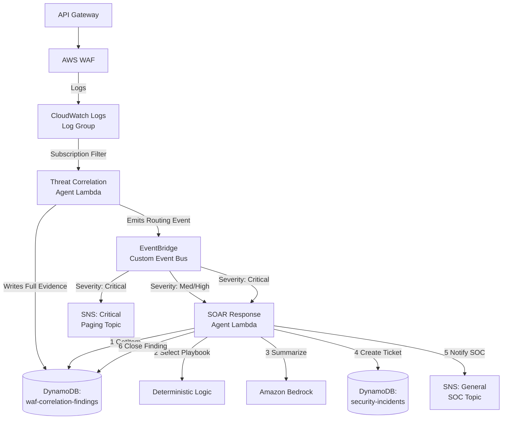

# Enterprise SOAR Incident Response Pipeline — Complete Build Guide

**Starting point (already built):** AWS WAF attached to API Gateway, logging to a **CloudWatch Logs log group**.

This is the complete, holistic reference for the pipeline — architecture, build order, and the reasoning behind every decision, from raw WAF logs through to a human-actionable, AI-enriched incident ticket.

---

## 1. Overview

This system is not a single Lambda function — it is a multi-stage assembly line for handling security events, moving from raw detection through to human notification. Understanding the flow end-to-end before writing Terraform or Python is the difference between "scripting" and "systems design."

The pipeline has four conceptual stations:

1. **The Sensor** (Upstream, already built) — AWS WAF blocks or logs a suspicious request.
2. **The Detective** — A Threat Correlation Agent analyzes the logs, confirms it's a real threat, and writes a detailed "Finding" to DynamoDB.
3. **The Doorbell** (EventBridge) — The Correlation Agent emits a lightweight event: *"a new finding was created."*
4. **The Responder** — The SOAR Response Agent wakes up, investigates, writes the ticket, and alerts the humans.

---

## 2. Architecture Diagram



**Key mental model:** EventBridge events are *notifications*, not *payloads*. The event only carries the finding ID and severity — never the full evidence. The Lambda then fetches the actual evidence from DynamoDB. This is the **"fat resource, thin event"** pattern: it keeps events small (avoiding EventBridge's 256KB payload limit) and ensures there is a single source of truth for the data, rather than evidence scattered across event payloads. This principle is also *why* switching the ingestion mechanism (covered next) barely touches the rest of the pipeline — everything downstream depends on a finding's shape, not on how the finding was produced.

---

## 3. Ingestion Design Decision: Why Subscription Filter → Lambda Directly

CloudWatch Logs has exactly one native "push" mechanism for real-time processing: a **subscription filter**. It can push matching log events to one of three destinations — Lambda directly, Kinesis Data Streams, or Kinesis Data Firehose.

| Approach | Latency | Cost at scale | Complexity | Batching control |
|---|---|---|---|---|
| Subscription filter → Lambda (direct) | Lowest | Higher per-invocation cost at high volume | Simplest | Small batches, no control over grouping |
| Subscription filter → Firehose → S3 → Lambda | Higher (Firehose buffers 60s–900s by default) | Cheaper at high volume | More moving parts | Full control via Firehose buffering config |

**Decision: subscription filter → Lambda directly.**

This pipeline exists to catch and respond to threats *quickly* — that's the entire premise of the Critical/SNS panic-button path. A Firehose buffering delay (60 seconds minimum) on ingestion would directly undermine the low-latency goal of the Critical routing rule. Firehose-style batching is the right tool for a **separate**, non-latency-sensitive pipeline — e.g., long-term log archival to S3 for compliance retention — not for the real-time detection path. This also keeps the build simpler: no Firehose, no separate S3 bucket sitting between WAF and the Correlation Agent.

---

## 4. Build Order

### Step 1 — CloudWatch Logs Subscription Filter

**What:** A subscription filter on the WAF log group that pushes matching log events directly to the Correlation Agent Lambda.

```hcl
resource "aws_cloudwatch_log_subscription_filter" "waf_to_lambda" {
  name            = "waf-logs-to-correlation-agent"
  log_group_name  = "aws-waf-logs-<your-web-acl-name>"   # must match WAF's configured log group
  filter_pattern  = ""   # empty = match all log events; narrow this later if volume is high
  destination_arn = aws_lambda_function.correlation_agent.arn
}

resource "aws_lambda_permission" "allow_cwl_invoke" {
  statement_id  = "AllowCloudWatchLogsInvoke"
  action        = "lambda:InvokeFunction"
  function_name = aws_lambda_function.correlation_agent.function_name
  principal     = "logs.amazonaws.com"
  source_arn    = "${aws_cloudwatch_log_group.waf_logs.arn}:*"
}
```

**Why `filter_pattern = ""` to start:** An empty pattern matches every log event — the safest default while validating the pipeline end-to-end. Once real traffic volume is understood, narrow this (e.g., filtering out `action: ALLOW` events at the subscription level rather than in Lambda), since most WAF log volume in a healthy system is allowed traffic, not blocks — filtering earlier reduces invocation count and cost.

**Why the explicit `aws_lambda_permission`:** CloudWatch Logs needs resource-based permission to invoke the Lambda. This is easy to forget and is the most common cause of "subscription filter exists but Lambda never fires" during first-time setup.

**Service limit to plan around now:** a single log group can have **only 2 subscription filters**. If a second consumer of these WAF logs is ever needed (e.g., a separate archival pipeline to S3, or a SIEM integration), there is exactly one filter slot left after this one — worth deciding on now rather than hitting the limit later.

---

### Step 2 — Threat Correlation Agent (Lambda) + `waf-correlation-findings` Table

**Build this first** (before EventBridge/SOAR) — it's the event *producer*. Nothing downstream is testable without it.

#### 2a. DynamoDB Table

```hcl
resource "aws_dynamodb_table" "waf_correlation_findings" {
  name         = "waf-correlation-findings"
  billing_mode = "PAY_PER_REQUEST"
  hash_key     = "finding_id"

  attribute {
    name = "finding_id"
    type = "S"
  }

  point_in_time_recovery {
    enabled = true
  }

  server_side_encryption {
    enabled = true
  }
}
```

**Why `PAY_PER_REQUEST`:** Security event volume is spiky by nature (quiet for hours, then a burst during an actual attack). On-demand billing avoids under-provisioned throttling exactly when the table matters most.

**Why `finding_id` as a plain hash key (no sort key):** Each finding is a single, complete unit — point lookups by ID, not a time-series query per finding. Keep it simple until a real access pattern demands otherwise.

#### 2b. The Lambda Handler — CloudWatch Logs Payload Handling

This is where the CloudWatch ingestion path differs concretely from an S3-based one. A CloudWatch Logs subscription filter delivers a payload that is:
- **Base64-encoded**
- **Gzip-compressed**
- Containing a `logEvents` array, where each entry is one WAF log line (JSON, nested as a string inside the CWL wrapper)

```python
import base64
import gzip
import json

def lambda_handler(event, context):
    # CloudWatch Logs subscription payloads always arrive compressed and encoded
    compressed_payload = base64.b64decode(event["awslogs"]["data"])
    uncompressed_payload = gzip.decompress(compressed_payload)
    log_data = json.loads(uncompressed_payload)

    findings = []
    for log_event in log_data["logEvents"]:
        waf_record = json.loads(log_event["message"])
        finding = correlate(waf_record)
        if finding:
            findings.append(finding)

    for finding in findings:
        write_finding(finding)
        emit_eventbridge_event(finding)
```

**Why this decode step is easy to get wrong:** the CloudWatch Logs subscription format is a fixed AWS wrapper structure that's always base64 + gzip, regardless of content. Skipping it is the single most common first-run bug with CWL subscription Lambdas — the function receives what looks like garbage binary data and errors immediately. Test this step in isolation (decode and print raw `logEvents`) before building correlation logic on top of it.

#### 2c. Correlation Logic

This is where "is this actually a threat" gets decided, regardless of ingestion method:

- Same IP triggering 5+ rule violations in 60 seconds → escalate severity
- A single `SQLi` or `XSS` managed-rule match → `HIGH` regardless of frequency
- Repeated `COUNT` (not `BLOCK`) actions from one IP → possible probing, `MEDIUM`

Once a finding is confirmed, write it to `waf-correlation-findings` with a generated `finding_id` (e.g., UUID or hash of IP+timestamp+rule), then publish a **thin** event to EventBridge:

```json
{
  "Source": "custom.waf.correlation",
  "DetailType": "WAF Threat Finding Created",
  "Detail": {
    "finding_id": "abc-123",
    "severity": "HIGH",
    "source_ip": "203.0.113.5",
    "rule_matched": "AWSManagedRulesSQLiRuleSet"
  }
}
```

**IAM for this Lambda:** `dynamodb:PutItem` scoped to `waf-correlation-findings` only, `events:PutEvents` scoped to the custom event bus only. (No `s3:GetObject` needed — there's no S3 object in this variant. The CloudWatch Logs invoke permission from Step 1 covers the trigger side.)

---

### Step 3 — EventBridge Routing Layer

**Build this second** — now that findings are being produced, there are real events to route.

#### 3a. Custom Event Bus (recommended over default bus)

```hcl
resource "aws_cloudwatch_event_bus" "security_events" {
  name = "security-findings-bus"
}
```

**Why a custom bus, not the default:** Isolates security event traffic from other application events, so rule-matching and metrics stay scoped cleanly, and a stricter resource policy can apply to this bus alone.

#### 3b. Rule 1 — Standard (Medium/High)

```hcl
resource "aws_cloudwatch_event_rule" "standard_findings" {
  name           = "route-standard-findings"
  event_bus_name = aws_cloudwatch_event_bus.security_events.name

  event_pattern = jsonencode({
    source      = ["custom.waf.correlation"]
    detail-type = ["WAF Threat Finding Created"]
    detail = {
      severity = ["MEDIUM", "HIGH"]
    }
  })
}

resource "aws_cloudwatch_event_target" "standard_to_lambda" {
  rule           = aws_cloudwatch_event_rule.standard_findings.name
  event_bus_name = aws_cloudwatch_event_bus.security_events.name
  arn            = aws_lambda_function.soar_agent.arn
}
```

#### 3c. Rule 2 — Critical (Panic Button, dual target)

```hcl
resource "aws_cloudwatch_event_rule" "critical_findings" {
  name           = "route-critical-findings"
  event_bus_name = aws_cloudwatch_event_bus.security_events.name

  event_pattern = jsonencode({
    source      = ["custom.waf.correlation"]
    detail-type = ["WAF Threat Finding Created"]
    detail = {
      severity = ["CRITICAL"]
    }
  })
}

resource "aws_cloudwatch_event_target" "critical_to_lambda" {
  rule           = aws_cloudwatch_event_rule.critical_findings.name
  event_bus_name = aws_cloudwatch_event_bus.security_events.name
  arn            = aws_lambda_function.soar_agent.arn
}

resource "aws_cloudwatch_event_target" "critical_to_sns" {
  rule           = aws_cloudwatch_event_rule.critical_findings.name
  event_bus_name = aws_cloudwatch_event_bus.security_events.name
  arn            = aws_sns_topic.critical_paging.arn
}
```

**Why two separate rules instead of one rule with conditional logic:** EventBridge rules can't branch internally — a rule either matches an event pattern or it doesn't, and every match fans out to *all* its targets. Two severity-scoped rules is the idiomatic way to get different fan-out behavior per tier. Don't collapse this into one rule with Lambda-side branching for the SNS paging — that reintroduces the exact dependency-on-Lambda problem the critical path exists to avoid: a critical alert should never wait on DynamoDB reads, Bedrock calls, and ticket writes to complete before a human is paged.

**Also required:** an `aws_lambda_permission` allowing EventBridge to invoke the SOAR Lambda, and an SNS topic policy allowing EventBridge to publish.

---

### Step 4 — SOAR Response Agent (Lambda) + `security-incidents` Table

**Build this third** — now the events exist to trigger it.

#### 4a. DynamoDB Table

```hcl
resource "aws_dynamodb_table" "security_incidents" {
  name         = "security-incidents"
  billing_mode = "PAY_PER_REQUEST"
  hash_key     = "incident_id"

  attribute {
    name = "incident_id"
    type = "S"
  }

  attribute {
    name = "status"
    type = "S"
  }

  global_secondary_index {
    name            = "status-index"
    hash_key        = "status"
    projection_type = "ALL"
  }

  server_side_encryption {
    enabled = true
  }
}
```

**Why two tables (`waf-correlation-findings` and `security-incidents`) instead of one:** A finding and an incident have different lifecycles and audiences. A finding is a piece of evidence — largely immutable, technical, written once. An incident is a workflow object for SOC analysts, with status transitions over time (`OPEN` → `ESCALATED` → `CLOSED`). Separating them lets each be queried and evolved independently.

**Why a GSI on `status`:** Analysts need to query "show me all `OPEN` incidents" — a query on a non-key attribute. Without the GSI, that requires a full table scan, which gets expensive and slow as the table grows. This is a direct example of designing DynamoDB access patterns around how the table will actually be *read*, not just written.

#### 4b. The 6-Step Lambda Logic

1. **Extract & Fetch** — pull `finding_id` from the EventBridge event, `GetItem` from `waf-correlation-findings`.
2. **Validate** — check the finding isn't already `RESPONSE_COMPLETED`; exit early if so (first idempotency guard, before the conditional write).
3. **Select Playbook** — hardcoded severity → action map. **The AI does not make this decision:**
   ```python
   PLAYBOOK = {
       "CRITICAL": "ESCALATE_IMMEDIATE",
       "HIGH": "ESCALATE",
       "MEDIUM": "MONITOR",
   }
   ```
4. **Enrich** — call Bedrock with a constrained prompt; fall back to a hardcoded template on failure.
5. **Record & Notify** — conditional `PutItem` to `security-incidents` using `INC-<finding_id>`; publish to the general SOC SNS topic.
6. **Close the Loop** — `UpdateItem` on `waf-correlation-findings`, setting status to `RESPONSE_COMPLETED`.

#### 4c. Idempotent Write — the Core Resilience Mechanism

```python
try:
    table.put_item(
        Item={
            "incident_id": f"INC-{finding_id}",
            "status": "OPEN",
            "severity": severity,
            "summary": ai_summary,
        },
        ConditionExpression="attribute_not_exists(incident_id)"
    )
except ClientError as e:
    if e.response["Error"]["Code"] == "ConditionalCheckFailedException":
        # Ticket already exists — this is a retry, not a new incident. Exit quietly.
        return
    raise
```

**Why this exists:** EventBridge → Lambda delivery is **at-least-once**, not exactly-once. A Lambda timeout, transient throttle, or EventBridge internal retry will resend the same event. Without this guard, a single real-world incident produces duplicate tickets and duplicate SNS pages — which trains analysts to ignore alerts (alert fatigue is itself a security risk, not just an annoyance). Using `INC-<finding_id>` as a deterministic natural key plus a conditional write is the standard way to make this idempotent, and is directly relevant to AWS Security Specialty exam scenarios on resilient response automation.

---

### Step 5 — Bedrock Integration (Enrichment Only)

**Build this last** — it's the least critical-path component; the pipeline works (with a fallback template) even without it.

```python
PROMPT_TEMPLATE = """
You are summarizing a security finding for a SOC analyst.
Do NOT recommend automatic IP blocking or any destructive action.
State clearly that a human analyst must review before action is taken.

Finding details:
{evidence_json}

Produce:
1. A 2-sentence executive summary
2. A 3-item analyst checklist
"""

def enrich_with_bedrock(evidence):
    try:
        response = bedrock_client.invoke_model(
            modelId="anthropic.claude-3-5-haiku-...",
            body=json.dumps({
                "messages": [{"role": "user", "content": PROMPT_TEMPLATE.format(
                    evidence_json=json.dumps(evidence))}]
            })
        )
        return parse_bedrock_response(response)
    except Exception:
        return create_fallback_summary(evidence)
```

**Why the prompt explicitly forbids destructive recommendations:** This keeps Bedrock in a pure "summarize and format" role. The playbook decision was already made deterministically in Step 4b-3 — Bedrock never has write access to any resource and never influences the severity → action mapping. The prompt wording is a courtesy, not the safety boundary; the actual safety boundary is architectural: Bedrock's output is only ever used as *text in a ticket field*, never as an input to a decision or a state-changing API call.

**Why the entire call is wrapped in `try/except`:** Bedrock availability and quotas are outside your control (regional availability, throttling, model deprecation). The fallback (`create_fallback_summary`) uses a plain string template with the same evidence — the incident still gets created and the SOC still gets notified, just with a less polished summary. The workflow's correctness never depends on an external AI service being up. This is a graceful degradation pattern: security automation should degrade to "less polished but still functional," never fail silently or fail closed.

---

### Step 6 — IAM Roles (Build Alongside Each Lambda, Not After)

Two distinct Lambda execution roles — do not share one role between the Correlation Agent and the SOAR Agent, since their access needs don't overlap.

**Correlation Agent role:**
- `dynamodb:PutItem` — scoped to `waf-correlation-findings` table ARN only
- `events:PutEvents` — scoped to the custom event bus ARN only
- (The CloudWatch Logs → Lambda invoke permission is a resource policy on the Lambda itself, configured in Step 1, not an IAM role permission)

**SOAR Agent role:**
- `dynamodb:GetItem`, `UpdateItem` — scoped to `waf-correlation-findings` table ARN only
- `dynamodb:PutItem` — scoped to `security-incidents` table ARN only
- `sns:Publish` — scoped to both specific topic ARNs (general + critical) only
- `bedrock:InvokeModel` — scoped to the specific foundation model ARN only

**Why separate roles matter beyond "best practice":** If the SOAR Lambda is ever compromised (e.g., a dependency vulnerability), a scoped role limits blast radius to exactly these actions on these named resources — it cannot write to the findings table beyond an update, cannot invoke arbitrary Bedrock models, and has no access at all to the ingestion side of the pipeline. This is least privilege made concrete, and exactly the kind of design decision the Security Specialty exam tests via scenario questions.

---

## 5. Testing Before Calling It Done

1. **Confirm the subscription filter is actually delivering events** before debugging correlation logic — check the Correlation Lambda's own CloudWatch Logs (a different log group than the WAF logs) for invocation entries. Zero invocations means the problem is the subscription filter or the invoke permission, not the parsing code.
2. **Test the decode step in isolation first.** Deploy a minimal handler that just base64-decodes, gunzips, and prints the raw `logEvents` — confirm real WAF log JSON is visible before building correlation rules on top of it.
3. **Test idempotency explicitly.** Manually fire the same EventBridge event twice (`aws events put-events` with an identical `finding_id`) and confirm:
   - First invocation → new item in `security-incidents`, SNS notification sent, `waf-correlation-findings` status updated.
   - Second invocation → `ConditionalCheckFailedException` caught, Lambda exits cleanly, **no duplicate item, no duplicate SNS message.**

If the second invocation produces a duplicate, the conditional expression or the idempotency key generation has a bug — don't move on until this passes.

---

## 6. Build Order Recap

| Order | Component | Depends On |
|---|---|---|
| 1 | CloudWatch Logs subscription filter | Existing WAF + API Gateway |
| 2 | Correlation Agent Lambda + `waf-correlation-findings` table | Step 1 |
| 3 | EventBridge custom bus + 2 rules | Step 2 (needs real events to route) |
| 4 | SOAR Agent Lambda + `security-incidents` table | Step 3 |
| 5 | Bedrock enrichment (with fallback) | Step 4 (non-blocking enhancement) |
| 6 | IAM roles | Built alongside Steps 2 and 4, not after |

---

## 7. Three Senior-Level Patterns Recap

| Pattern | Mechanism | Why It Matters |
|---|---|---|
| **Idempotency via deterministic IDs** | `INC-<finding_id>` + `attribute_not_exists` conditional write | EventBridge is at-least-once delivery; without this, retries create duplicate tickets and alert fatigue |
| **Defensive prompting (AI guardrails)** | Prompt forbids destructive actions; architecture keeps Bedrock write-access-free | Prompting is a nudge, not a guarantee — the real safety boundary is that Bedrock output only ever lands in a text field, never a decision or API call |
| **Golden Rule fallback** | `try/except` around Bedrock → hardcoded `create_fallback_summary()` | Security automation must degrade gracefully, not fail silently, when a dependency (AI or otherwise) is unavailable |

This order ensures that at every stage, there's a real, testable upstream producing real events — never writing code against a component that only exists in theory. Because the pipeline was built around the "thin event" principle from the start, everything from EventBridge onward is completely decoupled from how WAF logs were ingested — which is exactly why this guide could consolidate the ingestion-specific detail (Steps 1–2) while leaving the rest of the architecture untouched.