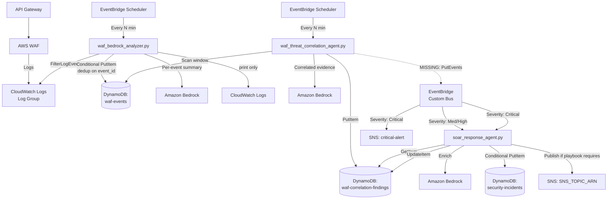

# Received from Mr. Ale on 07/31/2026 @ 7/31/2026
# Enterprise SOAR Incident Response Pipeline — Build Guide (Final, Code-Verified)

**Starting point (already built):** AWS WAF attached to API Gateway, logging to a CloudWatch Logs log group.

> **Major revision note:** This version replaces the ingestion architecture described in earlier drafts. Prior versions assumed a **CloudWatch Logs subscription filter** pushing events directly to a Lambda (requiring base64/gzip decoding). The actual code (`waf_bedrock_analyzer.py`) uses a completely different mechanism: a **scheduled Lambda that polls CloudWatch Logs via the `FilterLogEvents` API** on a rolling lookback window. There is no subscription filter anywhere in this pipeline, and no decode step is needed — `FilterLogEvents` returns plain, already-decoded JSON. This document reflects the real, three-Lambda architecture as implemented, with every gap found across three rounds of code review called out explicitly.

> **Sourcing note:** As requested, official AWS documentation is linked in Section 8 for every major architectural claim.

---

## 1. The Real Pipeline: Three Lambdas, Three Tables



The dotted arrow is deliberate — **it's the one connection that doesn't exist in the code yet.** Everything upstream and downstream of it works and has been reviewed; that single missing `events.put_events()` call is what prevents the pipeline from running end-to-end today.

---

## 2. Stage 1 — `waf_bedrock_analyzer.py` (Ingestion)

**What it does:** Runs on a schedule. Each invocation pulls a rolling window of recent WAF log entries directly from CloudWatch Logs via `FilterLogEvents`, normalizes each into a compact record, stores it in `waf-events` with a dedup-safe write, and generates a lightweight per-event Bedrock note (printed to logs only).

**Why polling instead of a subscription filter:** This is a legitimate, simpler alternative to what earlier drafts assumed. A subscription filter pushes in near-real-time but adds the base64/gzip decode step and a hard 2-filters-per-log-group limit. Polling via `FilterLogEvents` trades a small amount of latency (bounded by `LOOKBACK_MINUTES` and the schedule interval) for a simpler code path with no decode step and no per-log-group filter budget to manage. For a pipeline whose real-time responsiveness lives further downstream (the Critical dual-path SNS in Stage 3), this trade-off is reasonable.

### What's implemented well

- **Deterministic, dedup-safe `event_id`** — uses CloudWatch's own `eventId` when present, falls back to a SHA-256 hash of the event's stable fields otherwise. Paired with a conditional `PutItem` (`attribute_not_exists(event_id)`), this correctly prevents duplicate storage when scheduled lookback windows overlap.
- **Write-before-enrich, per event, with per-event fault isolation** — each event's `summarize → save → analyze` sequence is wrapped in its own `try/except` inside the loop. One bad event or one Bedrock failure doesn't lose the other events in the same batch, and the DynamoDB write always happens before the Bedrock call is attempted.

### Gaps to fix

**1. Bedrock runs even on duplicate events (cost/waste issue, not correctness).**
```python
was_stored = save_to_dynamodb(waf_summary)
if was_stored:
    stored_count += 1
ai_summary = call_bedrock(waf_summary)   # ← runs unconditionally
```
Every overlapping lookback window re-invokes Bedrock for events already processed in a prior run. Fix: gate the call behind `was_stored`.

**2. No pagination on `filter_log_events` — this is the priority fix.**
```python
response = logs_client.filter_log_events(
    logGroupName=WAF_LOG_GROUP,
    startTime=start_time_ms,
    endTime=end_time_ms,
    limit=MAX_LOG_EVENTS,   # 25 by default
)
```
There's no check of `response.get("nextToken")`. If more than `MAX_LOG_EVENTS` WAF log lines fall in one lookback window — exactly what happens during a real burst of attack traffic — the remainder are silently dropped, with no error and no indication anything was missed. This is the single most important fix in this Lambda: add a pagination loop using `nextToken`, same pattern already correctly implemented for DynamoDB in the correlation agent's `Scan`.

**3. Header truncation without redaction.**
`headers[:10]` caps the count but doesn't filter by name. If WAF's logged request includes `Authorization` or `Cookie` headers, their raw values get stored in DynamoDB and sent into the Bedrock prompt verbatim. Worth adding an explicit denylist (`Authorization`, `Cookie`, `X-Api-Key`, etc.) before persisting or sending anywhere.

**4. The per-event Bedrock summary is never persisted**, only `print()`'d. If this is intentionally a lightweight, log-searchable triage note distinct from the correlation agent's properly-stored narrative, that's a fine design — worth documenting as intentional rather than leaving it ambiguous.

### Environment variables (as implemented)
```
WAF_LOG_GROUP=<CloudWatch Logs log group name for WAF>
DYNAMODB_TABLE=waf-events
BEDROCK_MODEL_ID=anthropic.claude-3-haiku-20240307-v1:0
LOOKBACK_MINUTES=10
MAX_LOG_EVENTS=25
```

### IAM for this Lambda
- `logs:FilterLogEvents` — scoped to the WAF log group ARN only
- `dynamodb:PutItem` — scoped to `waf-events` table ARN only
- `bedrock:InvokeModel` — scoped to the specific model ARN
- `logs:CreateLogStream`, `logs:PutLogEvents` — this Lambda's own log group (standard execution logging)

---

## 3. Stage 2 — `waf_threat_correlation_agent.py` (Correlation)

**What it does:** Runs on its own schedule. Reads a configurable window of normalized events from `waf-events`, groups them by source IP/URI/rule, computes a transparent deterministic risk score, asks Bedrock to narratively interpret the deterministic findings, and stores the result in `waf-correlation-findings`.

### What's implemented well

- **Deterministic, auditable risk scoring** — `calculate_risk_score()` is a clear point system with a `reasons` list explaining every point awarded. This is exactly the kind of transparency the "AI never decides" principle depends on.
- **Disciplined Bedrock prompt** — explicitly forbids inventing IP reputation, geolocation, or identity data, and forbids claiming exploitation succeeded.

### Gaps to fix

**1. No EventBridge emission — this is the critical missing piece of the entire pipeline.**
`save_finding()` writes to `waf-correlation-findings` and returns, but nothing calls `boto3.client("events").put_events(...)`. Without this, `soar_response_agent.py` — which is fully built and waits on exactly this event — never gets invoked. This needs to be added at the end of the correlation run, once per finding:
```python
events_client = boto3.client("events")

events_client.put_events(
    Entries=[
        {
            "Source": "seir.waf.correlation",
            "DetailType": "WAF Threat Finding Created",
            "EventBusName": "security-findings-bus",
            "Detail": json.dumps({
                "finding_id": finding_id,
                "severity": severity,
                "risk_score": risk_score,
            }),
        }
    ]
)
```
This is the single change that connects Stage 2 to Stage 3 and makes the pipeline functional end-to-end.

**2. A Bedrock failure discards the entire finding, including the deterministic score already calculated.**
`call_bedrock()` raises on failure; the handler's `except` blocks return a 500 without ever calling `save_finding()`. Contrast with the SOAR agent's own `call_bedrock`/`create_fallback_summary` pattern, which is implemented correctly. Fix: wrap only the `call_bedrock()` call here in its own `try/except`, fall back to a plain-text summary built from `evidence_package["deterministic_findings"]`, and let `save_finding()` run regardless. **Important:** the SOAR agent's `validate_finding()` requires a non-empty `bedrock_report` field to proceed — the fallback text must be written to that same field, or a Bedrock outage here will cause every finding from that window to fail validation downstream too.

**3. `Scan` reads the entire table on every invocation, not just the window.**
`FilterExpression` is applied after DynamoDB retrieves and charges for the data — this Lambda pays for and reads every item in `waf-events`, not just what falls in the correlation window, and gets more expensive as the table grows regardless of window size. The code comment already flags this as a "first lab version." Priority fix: a GSI with a time-oriented key (e.g., a coarse date-hour partition key, sort key on `event_epoch`) to convert this into a `Query`.

**4. No checkpoint — overlapping scheduled windows can re-correlate the same underlying events into separate, near-duplicate findings.** Worth deciding whether the SOAR agent's own incident-level idempotency is sufficient protection, or whether this Lambda should track which source IPs it's already flagged recently.

**5. The Bedrock narrative's own "Overall Severity" heading is never reconciled with the deterministic `severity` field** stored on the finding. An analyst could see two different severities for the same finding. Either drop that heading from the prompt, or label it clearly as non-authoritative narrative.

### Environment variables (as implemented)
```
WAF_EVENTS_TABLE=waf-events
CORRELATION_FINDINGS_TABLE=waf-correlation-findings
BEDROCK_MODEL_ID=anthropic.claude-3-haiku-20240307-v1:0
CORRELATION_WINDOW_MINUTES=60
MINIMUM_EVENT_COUNT=3
MAX_EVENTS=500
ADMIN_URI_KEYWORDS=admin,login,signin,auth,token,cognito
```

### IAM for this Lambda
- `dynamodb:Scan` — scoped to `waf-events` table ARN (note: `Scan`, not `Query`, given the current implementation — revisit if the GSI fix above is applied)
- `dynamodb:PutItem` — scoped to `waf-correlation-findings` table ARN
- `bedrock:InvokeModel` — scoped to the specific model ARN
- `events:PutEvents` — scoped to the custom event bus ARN (**needs to be added along with the fix above**)
- `logs:CreateLogStream`, `logs:PutLogEvents` — this Lambda's own log group

---

## 4. Stage 3 — `soar_response_agent.py` (Response)

**What it does:** Triggered by the EventBridge event Stage 2 should emit. Retrieves the full finding, validates it, deterministically selects a playbook by severity, asks Bedrock for a formatted response (with a working fallback), creates an incident record, conditionally publishes an SNS notification, and closes the loop on the original finding.

### What's implemented well

- **The Bedrock fallback pattern is correct here** — `call_bedrock()` failure is caught specifically, falls back to `create_fallback_summary()`, and `create_incident()` still runs. This is the pattern Stage 2 is missing and should adopt.
- **`ConsistentRead=True` on `get_item`** — correctly accounts for the fact that this Lambda reads a finding that Stage 2 may have written moments earlier; avoids a theoretical stale-read race from DynamoDB's default eventually-consistent `GetItem`.
- **Explicit, machine-readable safety flags** — `containment_performed: False` and `human_review_required: True` are stored on the incident and included in the SNS message, not left implicit in prose.
- **Two independent idempotency layers** — the conditional `PutItem` on the incident (`attribute_not_exists(incident_id)`), and the conditional `UpdateItem` on the finding's status (`attribute_not_exists(#status) OR #status = :open_status`).

### Gaps to fix

**1. SNS notification is not gated on whether the incident was newly created — this is the priority fix here.**
```python
incident_id, incident_created = create_incident(...)
sns_message_id = publish_notification(...)   # ← runs regardless of incident_created
```
If two invocations for the same `finding_id` race (both read `status: OPEN` before either writes back), both pass validation, both proceed, and — even though only one incident record gets created — **both publish an SNS message**. Fix:
```python
if incident_created:
    sns_message_id = publish_notification(...)
else:
    sns_message_id = None
```

**2. Silent default on invalid/missing severity.**
```python
if severity not in PLAYBOOKS:
    print(f"Unknown severity '{severity}'. Defaulting to LOW.")
    return "LOW"
```
This fails in the wrong direction for a security system — bad or corrupted upstream data gets quietly routed to the *least* urgent playbook (no notification) instead of surfacing as an error. Should `raise ValueError` instead, so `validate_finding()` catches it and the failure is visible.

**3. Documentation correction (not a code bug):** the actual `PLAYBOOKS` dict creates an incident for **every** severity, including `LOW` — only the `notify` flag varies by tier. Earlier drafts of this guide assumed Low/Medium never got a ticket; the real implementation creates one for every finding and only gates SNS. This is a legitimate design (every finding becomes queryable via the incident table's `status` GSI) and is now the documented behavior.

### Environment variables (as implemented)
```
CORRELATION_FINDINGS_TABLE=waf-correlation-findings
SECURITY_INCIDENTS_TABLE=security-incidents
SNS_TOPIC_ARN=<SOAR agent's own validated-notification topic ARN>
BEDROCK_MODEL_ID=anthropic.claude-3-haiku-20240307-v1:0
ENABLE_BEDROCK=true
```

### IAM for this Lambda
- `dynamodb:GetItem`, `UpdateItem` — scoped to `waf-correlation-findings` table ARN
- `dynamodb:PutItem` — scoped to `security-incidents` table ARN
- `sns:Publish` — scoped to `SNS_TOPIC_ARN` only (**not** `critical-alert` — EventBridge publishes there directly; this Lambda never touches that topic)
- `bedrock:InvokeModel` — scoped to the specific model ARN
- `logs:CreateLogStream`, `logs:PutLogEvents` — this Lambda's own log group

---

## 5. EventBridge Routing (Per Mentor's Actual Configuration)

Two rules on a custom event bus, matching `source: seir.waf.correlation`, `detail-type: WAF Threat Finding Created`:

- **Medium/High** → target: `soar-response-agent` only
- **Critical** → targets: `soar-response-agent` **and** the `critical-alert` SNS topic, in parallel

Two SNS channels exist for different reasons: `critical-alert` is published to directly by EventBridge — fast, unvalidated, zero dependency on the Lambda completing. `SNS_TOPIC_ARN` is published to only by the SOAR agent itself, after validation and enrichment — slower, but every message on it has passed the full workflow. Both fire for Critical findings; only the agent's own topic applies to Medium/High.

**Note on the source string:** rules must match `seir.waf.correlation` exactly against whatever string Stage 2's new `put_events()` call actually emits — a typo here is a silent failure mode (findings pile up in DynamoDB, nothing errors anywhere).

---

## 6. Consolidated Build Order

| Order | Component | Depends On | Status |
|---|---|---|---|
| 1 | Three DynamoDB tables: `waf-events`, `waf-correlation-findings`, `security-incidents` | Nothing | Design confirmed |
| 2 | `waf_bedrock_analyzer.py` + its own EventBridge Scheduler | Step 1 | Built — needs pagination fix (Section 2, gap 2) |
| 3 | `waf_threat_correlation_agent.py` + its own EventBridge Scheduler | Step 2 (needs real data in `waf-events`) | Built — **missing EventBridge emission (Section 3, gap 1) — blocks Stage 3 entirely** |
| 4 | EventBridge custom bus + 2 rules + `critical-alert` SNS topic | Step 3 (needs the emission added first) | Not yet built |
| 5 | `soar_response_agent.py` + `SNS_TOPIC_ARN` topic | Step 4 | Built — needs notification-gating fix (Section 4, gap 1) |
| 6 | IAM roles + environment variables for all three Lambdas | Alongside Steps 2, 3, 5 | Mostly built — add `events:PutEvents` to Stage 2's role |

**The one blocking gap:** Steps 1, 2, 3 (partially), and 5 are functionally complete. Step 3's missing `put_events()` call and Step 4 (the EventBridge bus/rules) are the only pieces standing between "three well-built Lambdas" and "a working pipeline." Fix that first — everything else is refinement.

---

## 7. Priority-Ordered Fix List

1. **Add `events.put_events()` to the correlation agent** — nothing downstream runs without this.
2. **Add pagination to `filter_log_events`** — silent data loss during the exact scenario (a burst of attacks) this pipeline exists to catch.
3. **Gate SNS publish on `incident_created`** in the SOAR agent — closes a real duplicate-notification path.
4. **Add a Bedrock-failure fallback to the correlation agent**, writing to the same `bedrock_report` field the SOAR agent's validation requires.
5. **Change severity validation to fail loud, not fail to LOW.**
6. Lower priority: skip redundant Bedrock calls on duplicate events; redact sensitive headers; replace `Scan` with a `Query` against a time-based GSI; add a checkpoint or dedup window for the correlation agent.

---

## 8. Sources & Further Reading

**CloudWatch Logs — polling vs. push ingestion**
- [FilterLogEvents API reference](https://docs.aws.amazon.com/AmazonCloudWatchLogs/latest/APIReference/API_FilterLogEvents.html) — confirms the paginated response shape (`nextToken`) behind gap #2 in Section 2
- [Real-time processing of log data with subscriptions](https://docs.aws.amazon.com/AmazonCloudWatch/latest/logs/SubscriptionFilters.html) — the push-based alternative this codebase does not use; confirms base64/gzip encoding is specific to that mechanism, not `FilterLogEvents`

**DynamoDB**
- [Condition expressions in DynamoDB](https://docs.aws.amazon.com/amazondynamodb/latest/developerguide/Expressions.ConditionExpressions.html) — the `attribute_not_exists()` / `ConditionalCheckFailedException` mechanism behind every idempotent write in this pipeline
- [DynamoDB read consistency](https://docs.aws.amazon.com/amazondynamodb/latest/developerguide/HowItWorks.ReadConsistency.html) — confirms `GetItem` is eventually consistent by default and what `ConsistentRead=True` changes
- [Best practices for querying and scanning data](https://docs.aws.amazon.com/amazondynamodb/latest/developerguide/QueryAndScanGuidelines.html) — basis for the `Scan`-vs-`Query` cost concern in Section 3, gap 3

**EventBridge**
- [Event pattern syntax](https://docs.aws.amazon.com/eventbridge/latest/userguide/eb-create-pattern.html) — matching behavior behind the two severity-scoped rules in Section 5
- [Using resource-based policies for Amazon EventBridge](https://docs.aws.amazon.com/eventbridge/latest/userguide/eb-use-resource-based.html) — how EventBridge is granted permission to invoke Lambda and publish to SNS directly

**Amazon Bedrock**
- [Submit prompts and generate responses using the API](https://docs.aws.amazon.com/bedrock/latest/userguide/inference-api.html) — `InvokeModel` usage referenced throughout all three Lambdas

**IAM**
- [SEC03-BP02 Grant least privilege access](https://docs.aws.amazon.com/wellarchitected/latest/framework/sec_permissions_least_privileges.html) — basis for scoping every IAM action in Sections 2, 3, and 4 to specific resource ARNs